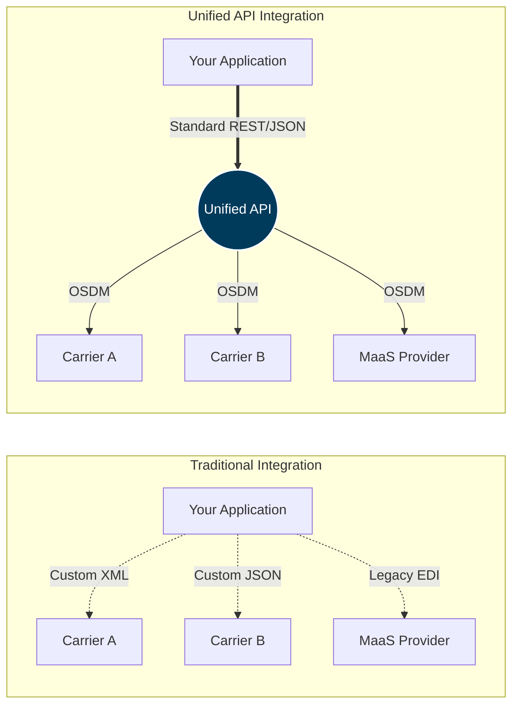

# Platform Overview: Unified Travel API

!!! abstract "Portfolio Context"
    **The challenge:** The company was launching a brand-new RESTful Retail API based on the OSDM (Open Sales & Distribution Model) standard to replace its legacy SOAP systems. The product lacked technical documentation that effectively explained its architectural value proposition to CTOs and lead developers.
    
    **My approach:** I authored this conceptual overview to bridge the gap between business value and technical implementation. I included architectural diagrams using Mermaid.js (which renders perfectly in our docs-as-code pipeline) to visually demonstrate how the API abstracts away the complexity of integrating with dozens of disparate mobility providers.
    
    **Note:** Company specifics and URLs have been genericized for this portfolio piece.

---

## Introduction

The Unified Travel API is a standards-based retail platform that provides developers with a single interface for the complete rail and ground transport commerce journey. It is engineered to abstract away the complexity of a fragmented global mobility market, where integrating with multiple proprietary systems has traditionally been a major barrier to innovation.

Built on the [Open Sales & Distribution Model (OSDM)](https://osdm.io/){target="_blank"}, it eliminates the need to connect to separate Mobility-as-a-Service (MaaS) aggregators or proprietary carrier links. Instead, it offers a consistent RESTful interface for the entire travel lifecycle: shopping, booking, fulfillment, and complex after-sales operations across global transport networks. 

This "common language" means a train journey and a bus leg are represented as predictable objects, dramatically simplifying the development of multi-modal itineraries.

## The Integration Advantage

Traditional rail and MaaS integrations require connecting to dozens of different APIs, each with unique data formats, authentication methods, and business rules. 



The Unified Travel API solves the traditional integration headache by providing:

*   **Single API integration** instead of multiple carrier/provider-specific implementations.
*   **Standardized data models** based on the cross-industry OSDM specification.
*   **Consistent authentication** using OAuth2 across all rail operators and MaaS providers.
*   **Unified error handling** and response formats.
*   **Real-time availability** and pricing routed from multiple concurrent sources.

## Authentication

To ensure secure communication, the API uses the OAuth2 client credentials flow. This process allows your application to obtain a temporary access token that must be included in all subsequent API requests.

### Step 1: Request an access token

Make a `POST` request to the test or production token endpoint. You must send your `client_id` and `client_secret` as `application/x-www-form-urlencoded` parameters.

```bash title="cURL Request"
curl -X POST "https://api.travel-platform.example.com/oauth2/token" \
  -H "Content-Type: application/x-www-form-urlencoded" \
  -d "grant_type=client_credentials" \
  -d "client_id=YOUR_CLIENT_ID" \
  -d "client_secret=YOUR_CLIENT_SECRET"
```

### Step 2: Use the token

A successful request returns a JSON object containing your access token and its expiration time (in seconds). 

```json title="Response"
{
    "access_token": "eyJraWQiOiI2eFlWRn...[truncated]...Dy4cBg",
    "expires_in": 3600,
    "token_type": "Bearer"
}
```

You must then include this `access_token` in the `Authorization: Bearer` header of all subsequent API requests.