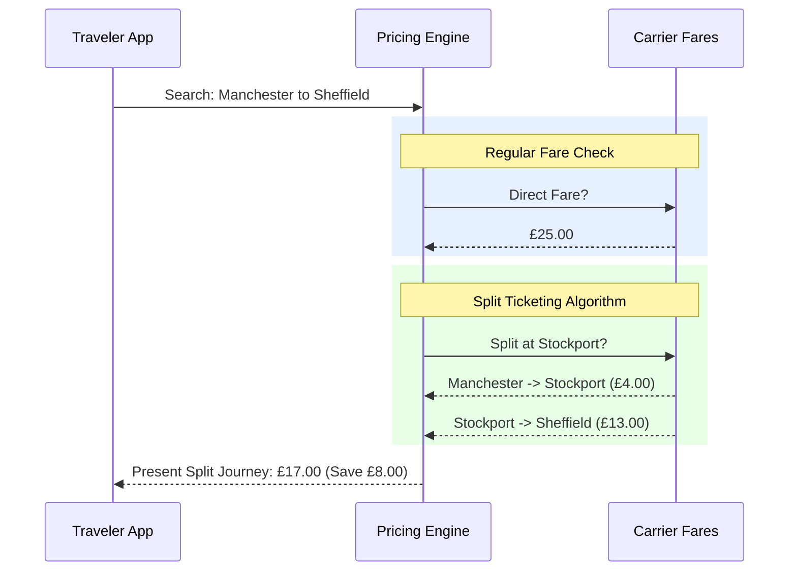

# How-To Guide: Split Ticketing

!!! abstract "Portfolio Context"
    **The challenge:** The platform introduced a highly complex algorithm for "Split Ticketing" (breaking a passenger's journey into multiple sub-tickets to exploit algorithmic fare loopholes). Developers integrating this feature repeatedly failed because the business logic rules around cancellations and seat assignments were highly convoluted.
    
    **My approach:** I wrote this domain-specific How-To guide. Rather than just giving endpoint schemas, I heavily utilized sequence diagrams (converted here to Mermaid.js) and bulleted constraints to explicitly warn developers about edge cases (like how partial cancellations are structurally forbidden). This dramatically reduced integration support tickets.
    
    **Note:** Company specifics and URLs have been genericized.

---

## Intro

For specific regional markets, the platform provides Partners the possibility of offering customers cheaper tickets for their journeys through **Split Ticketing**. 

Split Ticketing works by finding combinations of tickets that together offer the same continuous physical journey but at a lower combined price than a regular end-to-end ticket.

### How it works

The following diagram illustrates how the pricing engine breaks down a journey from Manchester to Sheffield into two separate tickets transparently to the traveler. 

*(Note: Pricing shown is purely representative for explanatory purposes.)*

## Working with split ticketing

The algorithmic complexity requires strict operational constraints. Please observe the following technical requirements when implementing Split Ticketing in your application:

### Fares and Journeys

*   **Fare Types:** The system supports Advance, Off-peak, and Anytime fares for splits.
*   **Search Limitations:** We do *not* support Split Ticketing on "open return" searches. The API will immediately return an error if you pass `includeReturnFares=true` with the split ticket boolean.
*   **Fulfillment:** All Split Tickets on a single booking order **must** be fulfilled using the same delivery method (e.g., all e-tickets or all physical). 

### Cancellations and Fraud Prevention

To prevent ticket fraud (such as traveling part of the journey and refunding the rest improperly), the API enforces strict state machine rules:

*   **No Individual Cancels:** Canceling individual Split Tickets on an order is unsupported. You must cancel the *entire* order (full cancel) or all the `TicketableFares` for a given Leg Solution together (partial cancel).
*   **Advance Fares:** Split Tickets containing restricted *Advance* fares cannot be canceled at all through the platform.

### Ancillary Services (Seating)

The core value proposition of our Split Ticketing engine is passenger comfort. On journeys where passengers legally hold two tickets but physically remain on the same train, the service allocator attempts a unified seat map request.

!!! success "Seamless Seating"
    The booking engine will purposefully attempt to allocate **the exact same seat** across both ticket legs. This ensures passengers are not forcefully required to switch carriages or seats mid-journey just because their digital paper trail changed.

**Unsupported Ancillaries:** Note that we do not support bike reservations, Travel Cards, or PlusBus addons for Split Ticket bookings. These will be stripped from the `validateBookingResponse` if requested.